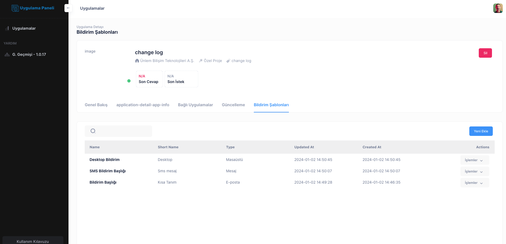
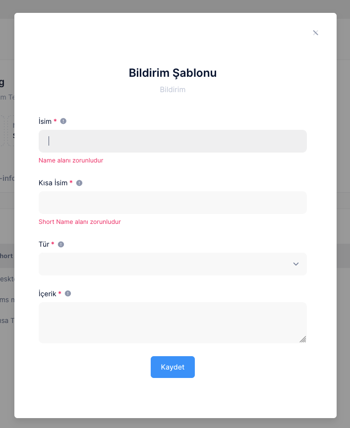

# Bildirim Şablonu

DataTablo ekranında Eklenen mesajların listesini Mesaj başlıgı, kısa isim, Mesaj Tipi Güncelleme ve Kayıt tarihi şeklinde görebilirsiniz

İşlem Butonu aracılığıyla Düzenleme veya kayıt silme yapabilirsiniz.

# Yeni Bildirim Oluşturma

Yeni ekle Butonu ile açılan Popup pencerede yer alan gerekli alanları girerek
mesaj gönderme yapablirsiniz

## Bildirim Başlığı

Bildirim adı

# Kısa Başlık

- Bildirim için Kısa tanımlayıcı Bir başlık girilir

## Bildirim Tipi

- Bildirim Tipleri Sms , E-Posta, Masaüstü Şeklindedir.

- SMS Bildirim **Cep telefonlarından görüntülenebilen Kısa Mesaj Bildirimi**
- E-Posta Bildirim **Bilgisayardan Telefondan görüntülenebilen Bildirim şekli**
- Masaüstü Bildirimi **Bilgisayardan görüntülenebilen Masaüstü Client Bildirim**