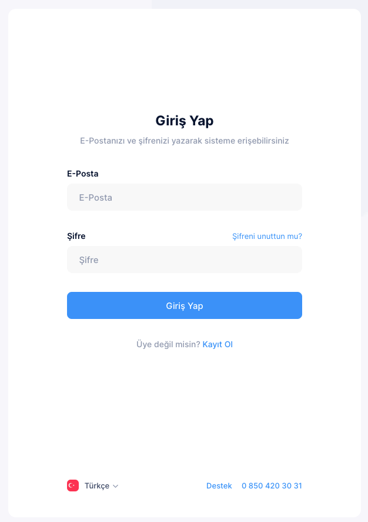

# Login
**Click to button on Login**

Unlem provides API's to make it possible for customers to create their custom integrations with Private Apps. Accessing Unlem API is designed to be simple and secure. An access token should be used to authenticate with Unlem APIs and send requests.

```js
http://auth.unlemcloud.com/sign-in
```
- username
- password

**Click to Forgot password**

- Forgot password

Trouble logging in? Enter your email,  username and we'll send you a link to get back into your account

```js
http://auth.unlemcloud.com/password-reset
```

**Click to Sign Up**

:::tip
- Sign Up
Not a member? Please Register Now

:::


```js
http://auth.unlemcloud.com/sign-up
```


