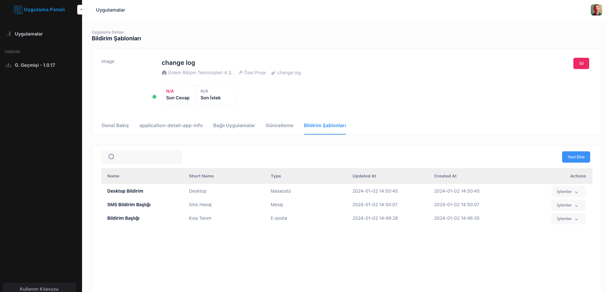
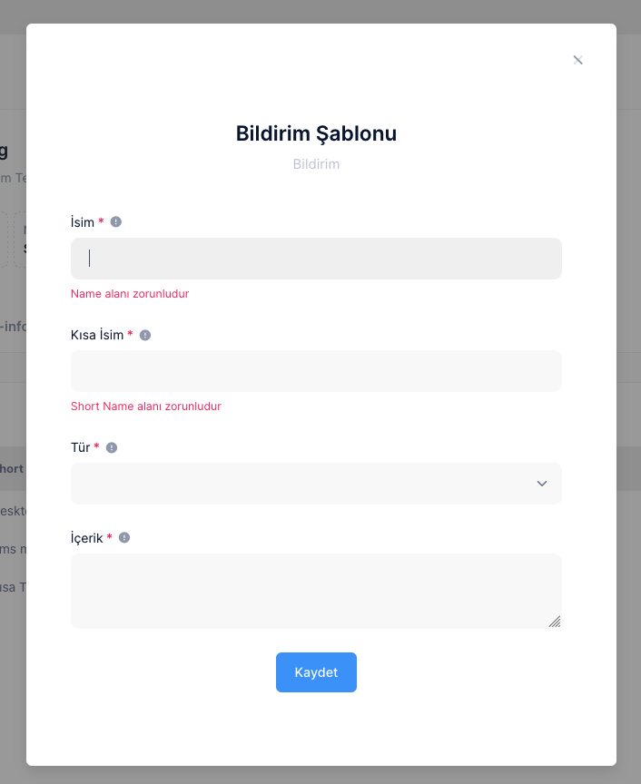

# Notification Template

In the DataTable screen you can see the list of added messages in the form of Message title, short name, Message Type Update and Save date

You can edit or delete records via the Action Button.

# Creating a New Notification

By entering the required fields in the Popup window opened with the Add New button
you can send a message

## Notification Header

Notification name

# Short Title

- Short descriptor for the notification A title is entered

## Notification Type

- Notification Types are SMS, E-Mail, Desktop.

- SMS Notification **Short Message Notification that can be viewed from mobile phones**
- E-Mail Notification **Notification form that can be viewed from computer and phone**
- Desktop Notification **Desktop Client Notification that can be viewed from a PC**