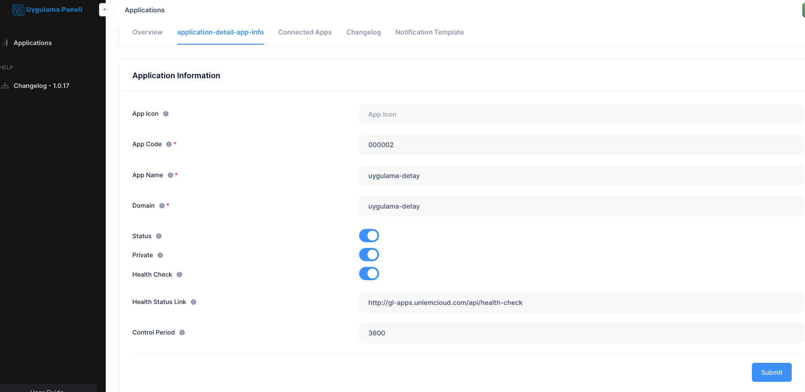

# Application

About Application

- Application icon **[input]** 
- Application code **[input]** 
- Application name **[input]** 
- Domain **[input]** 
- Active or Passive Options **[Default]** Passive 
- Secret **[Select]** 
- Health Check Select "Active" or "Inactive" button **[Default]** Inactive 
- Health Status Link **[input]** 
- Control Range **[input]**

